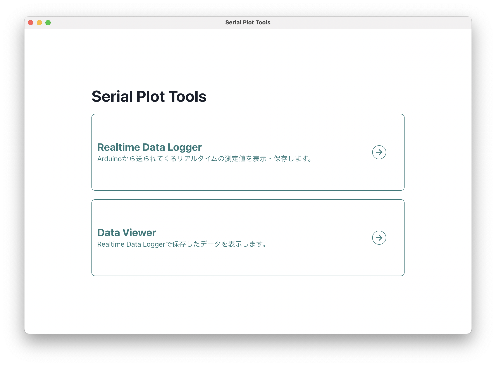
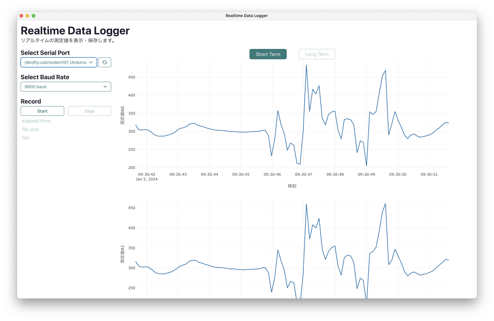

# Serial Plot Tools

Arduino などからのシリアル通信の値をリアルタイムにプロットし、csv データとして保存するためのアプリケーション




## How to use

Install の項に従ってインストールすると簡単に使用できます。

Arduino のスケッチファイルについては、`arduino_example`を参考にしてください。

## Change log

[Change Log](https://github.com/kiyu-git/Serial-Plot-Tools/blob/main/CHANGELOG.md)

## Install

### Mac

[release ページ](https://github.com/kiyu-git/Serial-Plot-Tools/releases/)から dmg ファイルをダウンロードし、ダブルクリックでインストールしてください。

なお、初回に開くときは、右クリックから「開く」を選択後、ポップアップメニューから「開く」を選択して開いてください。

### Windows

[release ページ](https://github.com/kiyu-git/Serial-Plot-Tools/releases/)から exe ファイルをダウンロードし、インストールしてください。

### Linux

armv7 (Raspberry pi 32bit)の場合は[release ページ](https://github.com/kiyu-git/Serial-Plot-Tools/releases/)から AppImage ファイルをダウンロードし、インストールしてください。

それ以外の場合は、以下の Develop に従って、アプリをご自身でビルドしてください。

## Develop

nodejs をインストールし、以下の Install、Start App に従うことにより、アプリを利用・開発することができます。

Electron React Boilerplate を元に、開発しています。開発の際のコマンドなどは、そちらの[公式ページ](https://electron-react-boilerplate.js.org)を参考にしてください。

Clone the repo and install dependencies:

```bash
git clone https://github.com/kiyu-git/Serial-Plot-Tools.git
cd Serial-Plot-Tools
npm install
cd release/app
npm install
cd ../..
```

### Start App

```bash
npm start
```

### Packaging for Production

To package apps for the local platform:

```bash
npm run package
```

## License

MIT
